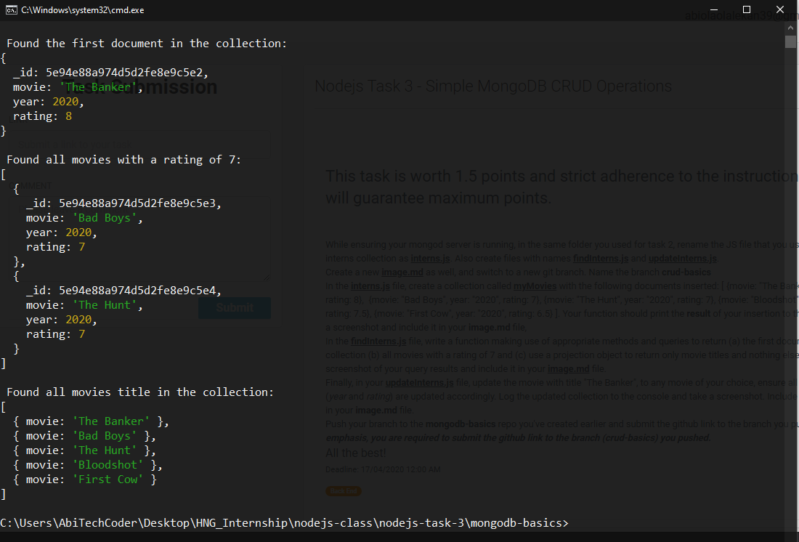
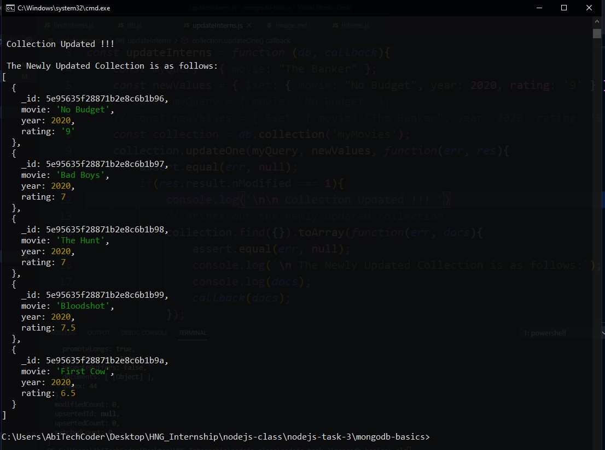

# Basic CRUD Operations
Simple MongoDB CRUD Operations
## Screenshots for the task are shown below:

### 1. The screenshot showing the result of the Inserted movies 
 

### 2. The screenshot showing the result of methods used to query the collection.

### 3. The screenshot showing the result of the updated collection.

